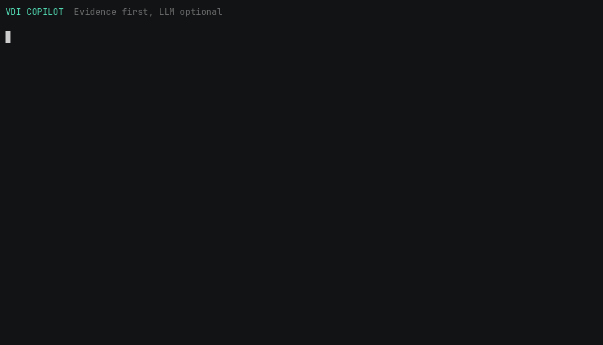

# VDI Copilot

[](https://github.com/gandara-dev/vdi-copilot/actions/workflows/ci.yml)
[](pyproject.toml)
[](LICENSE)

VDI incidents produce scattered Windows events, VDA logs, StoreFront logs, and
guesses. VDI Copilot turns those artifacts into an evidence-first report. Its
deterministic rules own every finding; an optional LLM may explain the report,
but it cannot add a cause or silently change confidence.



## Architecture


## Two-minute quick start

Python 3.11 or newer is the only requirement. The analyzer has no runtime
dependencies and the sample contains only synthetic data.

```bash
git clone https://github.com/gandara-dev/vdi-copilot.git
cd vdi-copilot
python -m pip install -e .
vdi-copilot analyze samples/incidents/vda-registration-dns
```

Expected first finding:

```text
[HIGH] VDA registration is failing because a controller name cannot be resolved
Rule: vda-registration-dns
```

Try the second known-cause incident:

```bash
vdi-copilot analyze samples/incidents/storefront-sta-failure --format json
```

## Collect evidence on Windows

Run from a trusted administrative workstation or the affected host. Event-log
access depends on the caller's Windows permissions.

```powershell
vdi-copilot collect `
  --event-log Application `
  --event-log System `
  --log 'C:\ProgramData\Citrix\Workspace Environment Management Agent\Logs' `
  --log 'C:\Program Files\Citrix\Receiver StoreFront\Admin\Trace' `
  --output collected-incident.json

vdi-copilot analyze collected-incident.json --output report.txt
```

Files larger than 2 MB are rejected rather than silently flooding a report.
Pass individual files or narrow directories when product log trees are large.
The collector uses the built-in `wevtutil`; it installs no agent and changes no
system setting.

## Privacy model

Redaction is on by default for collection and analysis. It replaces common
credentials, bearer tokens, email addresses, IPv4 addresses, FQDNs, Windows
user-profile paths, and domain-style SIDs. Redaction is best-effort, not a DLP
guarantee: inspect a bundle before sharing it.

Disabling it requires two explicit flags:

```bash
vdi-copilot analyze incident.log \
  --no-redact --acknowledge-sensitive-data
```

Never upload an unreviewed bundle to a third-party model endpoint. Retention,
regional processing, and access controls remain the operator's responsibility.

## Deterministic rules

The packaged schema-version 1 rules cover synthetic examples for:

- VDA registration failure caused by controller DNS resolution;
- StoreFront/Gateway STA validation failure;
- profile-container locks;
- authentication failures caused by clock skew.

Rules use case-insensitive `all`, `any`, and `none` substring matchers and return
fixed confidence plus reviewable recommendations. Copy
`src/vdi_copilot/default_rules.json`, keep the schema, and pass your version:

```bash
vdi-copilot analyze incident.json --rules rules/my-rules.json
```

Rule matches are diagnostic leads, not automatic remediation. Validate the
evidence, timestamps, scope, and proposed checks before changing production.

## Optional local LLM explanation

[Ollama's chat API](https://docs.ollama.com/api/chat) supports non-streaming JSON
responses. A practical small default is
[`qwen3:4b-instruct`](https://ollama.com/library/qwen3%3A4b-instruct), currently
about 2.5 GB in Ollama's registry:

```bash
ollama pull qwen3:4b-instruct
vdi-copilot analyze samples/incidents/vda-registration-dns \
  --llm ollama --model qwen3:4b-instruct
```

The prompt receives only redacted excerpts and deterministic findings. It asks
for a short JSON summary, disables streaming and thinking output, and treats the
answer as advisory. If Ollama is unavailable or returns invalid JSON, the CLI
fails clearly instead of fabricating an explanation.

Any remote service exposing the same `/api/chat` contract can be selected. This
sends evidence outside the machine, so review the bundle and the service's data
policy first:

```bash
export VDI_COPILOT_API_KEY='set-this-outside-shell-history'
vdi-copilot analyze collected-incident.json \
  --llm ollama --endpoint https://llm.example.test --model approved-model
```

## JSON output

```bash
vdi-copilot analyze samples/incidents/vda-registration-dns \
  --format json --output report.json
```

The stable top-level fields are `schema_version`, `redacted`, `sources`,
`findings`, and `explanation`. That makes the deterministic output suitable for
ticket attachments and regression tests without requiring an LLM.

## Development

```bash
python -m pip install -e ".[dev]"
pytest --cov=vdi_copilot
ruff check .
ruff format --check .
```

CI runs the synthetic known-cause suite on Python 3.11 and 3.13, on both Linux
and Windows. No Citrix infrastructure, credentials, or model download is used.

## Limitations

- Default rules are deliberately small and conservative, not an exhaustive
  Citrix knowledge base.
- Substring matching does not replace timeline reconstruction or vendor support.
- Redaction may miss organization-specific identifiers or secrets.
- The collector does not retrieve remote machines, memory, registry, or network
  traces; operators must place those artifacts in scope explicitly.
- No command in this project performs remediation.

## Documentation

- [Architecture](docs/architecture.md)
- [Operations and privacy](docs/operations-guide.md)
- [Testing](docs/testing.md)
- [Security policy](SECURITY.md)
- [Contributing](CONTRIBUTING.md)

## License

[MIT](LICENSE)
