# Architecture

VDI Copilot is evidence-first: deterministic rules own every finding,
confidence value, and recommended check. An optional language model can explain
those findings but cannot create or modify them.

## Pipeline

1. The collector reads explicitly selected files, directories, or Windows event
   channels and creates a schema-versioned evidence bundle.
2. Redaction replaces common secret and identity patterns by default.
3. The analyzer normalizes file or bundle input into evidence records.
4. Versioned rules evaluate case-insensitive `all`, `any`, and `none` matchers.
5. Findings contain rule ID, title, confidence, evidence excerpts, and fixed
   recommendations.
6. Console or JSON rendering produces the report.
7. When enabled, the LLM receives only redacted excerpts and completed findings.

## Trust boundaries

Raw logs and event records are untrusted and potentially sensitive input. The
local filesystem, Windows event-log API, optional model endpoint, and output
directory are separate trust boundaries. Redaction reduces exposure but is not
a DLP guarantee; an operator must review bundles before sharing them.

The remote LLM path is opt-in. The bearer token comes from an environment
variable and is sent only to the configured endpoint. Model output remains
advisory text outside the deterministic finding contract.

## Safety properties

- Collection scope is explicit; no remote discovery or agent installation occurs.
- Files larger than 2 MB are rejected.
- Disabling redaction requires two explicit flags.
- Invalid rule schemas and invalid LLM JSON fail clearly.
- No command performs remediation or changes a VDI environment.

## Current limitations

Version `0.1.0` uses substring correlation rather than a temporal event graph.
Default rules cover a deliberately small set of known causes. Organization-
specific identifiers may require custom redaction and rules.
